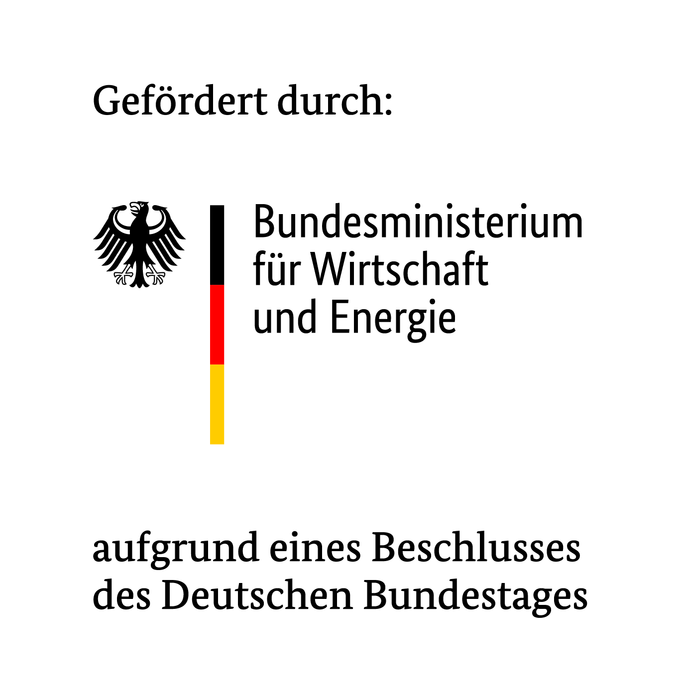

# CLOU - Clean OPC UA Information Modeling

CLOU is a platform for analyzing and improving OPC UA model quality through semantic search, metrics analysis and linting.

## Getting Started

### Prerequisites

- [Docker](https://www.docker.com/)
- [Docker Compose](https://docs.docker.com/compose/)
- [Git LFS](https://git-lfs.com) *(only required when building from source)*

Docker alternatives such as Podman or other compatible tools have not been tested but may also work, as long as they support Docker Compose-compatible workflows.

### Quick Start

There are two ways to run the project:

#### Option 1: Use pre-built Docker images (recommended)

This is the easiest and fastest way. You only need the [`docker-compose.yml`](docker-compose.yml) file.

1. Download the [`docker-compose.yml`](docker-compose.yml) file from this repository.
2. Start the services:

    ```bash
    docker compose up
    ```

Docker will automatically pull the required pre-built images.

#### Option 2: Build from source

Use this option if you want to build the Docker images locally.

> Make sure Git LFS is installed before cloning the repository.

1. Clone the repository:

    ```bash
    git clone git@github.com:iswunistuttgart/CLOU.git
    cd CLOU
    ```

2. Build and start the services:

    ```bash
    docker compose up --build
    ```

Subsequent starts can be done with:

```bash
docker compose up
```

#### Available Endpoints
- **Frontend**: http://localhost:5173
- **Backend API**: http://localhost:8000/docs *(for development)*
- **Database**: localhost:5432 *(for development)*

### GPU Support

For GPU-accelerated embeddings, an NVIDIA GPU and the NVIDIA Container Toolkit are required.

The GPU-enabled embedding service image is not provided as a pre-built image and must be built locally:

```bash
docker compose -f docker-compose.yml -f docker-compose.gpu.yml up --build
```

Note: The GPU embedding image requires significantly more memory than the CPU version, but slightly improves search speed.

### Import Profile

For imports to the database, start the catch-up worker for embedding:

```bash
docker compose --profile import up -d embedding-catchup-worker
```

### Stopping

```bash
docker compose down
```

## Configuration

Environment variables are defined in `backend/.env`. Copy from `backend/.env.example` for local development.

## Project Structure

| Directory | Description |
|-----------|-------------|
| `backend/` | FastAPI application, database, migrations |
| `frontend/` | React + TypeScript web UI |
| `services/embedding/` | Sentence-transformers service for semantic search |
| `services/linting/` | C# OPC UA linting tool |
| `services/metrics/` | C# OPC UA metrics calculator |


## License

Licensed under the Apache License 2.0. See [LICENSE](LICENSE) and [NOTICE](NOTICE) for details.

## Credits
This software was developed by  
[Fraunhofer Institute for Machine Tools and Forming Technology IWU](https://www.iwu.fraunhofer.de)  
and  
[Institute for Control Engineering of Machine Tools and Manufacturing Units ISW](https://www.isw.uni-stuttgart.de) of the University of Stuttgart.


## Funding Note

<p align="center">
    <a href="https://www.igf-foerderung.de">
        
    </a>
    <a href="https://www.bmwe.de">
        
    </a>
</p>

**The project is funded by the Federal Ministry for Economic Affairs and Energy pursuant to a resolution of the German Bundestag.**

Through the open-topic, cross-sector funding program “Industrial
Collaborative Research” (IGF), the Federal Ministry for Economic Affairs and Energy
funds precompetitive research projects.
